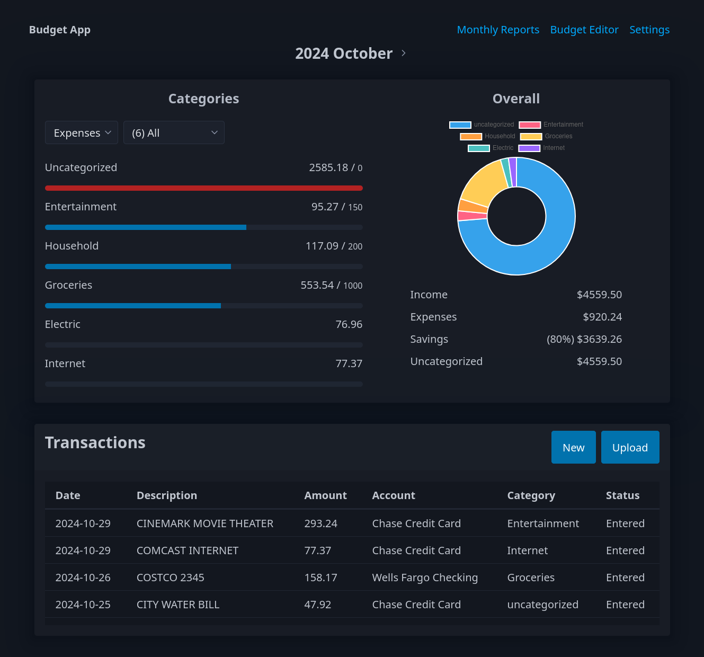
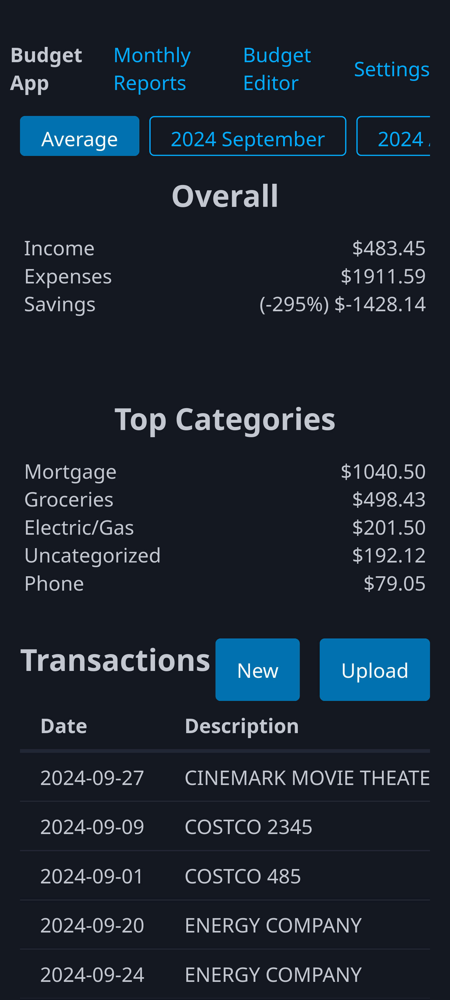
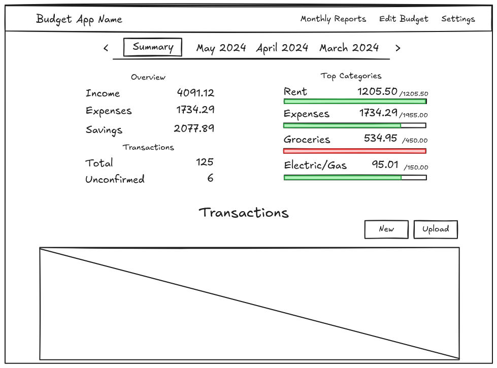

# [Budget App](https://dthigpen.github.io/budget-app/)

A web application for tracking expenses, categorizing transactions, and analyzing spending habits!

Currently this project is an experiment to simplify the web stack, taking inspiration from [Plain Vanilla Web](https://plainvanillaweb.com).

## Features

- Automatic transaction categorization
- Monthly and average spending breakdown
- Plain-text budget format to reduce platform lock-in
- Budget goals (planned)
- Batch import of transactions in CSV or JSON format (planned)
- Transaction, budget, report export (planned)
- PWA (Progressive Web App) support for offline usage (planned)

## Screenshots

### Desktop

### Mobile

## Wireframe

### Spending Reports

