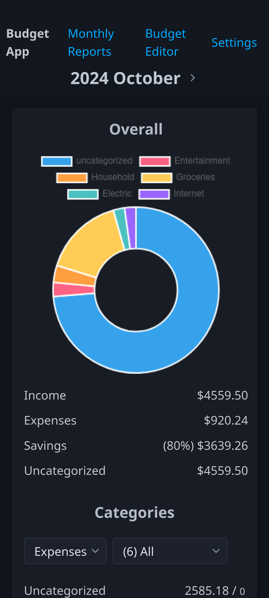

# [Budget App](https://dthigpen.github.io/budget-app/)

A web application for tracking expenses, categorizing transactions, and analyzing spending habits!

Currently this project is an experiment to simplify the web stack, taking inspiration from [Plain Vanilla Web](https://plainvanillaweb.com).

## Features

| Feature                                                 | Status           |
|---------------------------------------------------------|------------------|
| No third-party bank access (on-device only)             | ✅ (Implemented) |
| Monthly spending breakdown                              | ✅ (Implemented) |
| Chart view of spending                                  | ✅ (Implemented) |
| Plain-text budget format to reduce platform lock-in     | ✅ (Implemented) |
| Create, remove, update, delete individual transactions  | ✅ (Implemented) |
| CSV transaction import                                  | 🗓️ (Planned)     |
| Full data import/export (transactions, budget, settings)| 🗓️ (Planned)     |
| Configurable, automatic transaction categorization      | 🗓️ (Planned)     |
| Budget category goals                                   | 🗓️ (Planned)     |
| PWA (Progressive Web App) support for offline usage     | 🗓️ (Planned)     |

## Screenshots

### Desktop

### Mobile

## Wireframe

### Spending Reports

